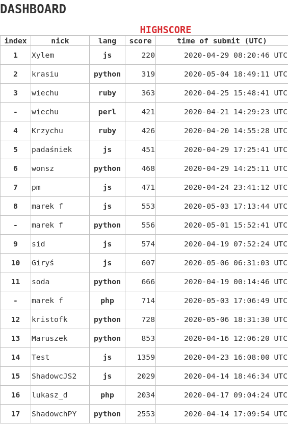

# golf-results-2020-summer



# Task

## Rules
* The program performs a simulation of an epidemic simulation and prints ASCII's map of people (see examples).
* The output must be printed to **STDOUT**.
* The output must have a newline char `(\n)` at the end.
* Program gets 2 arguments (argv)
* Arguments are always valid.
* First argument `K` is an integer defining the number of iterations.
* Second argument is a string representing the population separated with commas (see description of the `XYSQ` code below).
* **Each** line must have newline char (\n) at the end.
* The last line must not have any characters after newline char `(\n)`.

## Description

Inspiration for this golf is another simulation created by Washington Post
([https://www.washingtonpost.com/graphics/2020/world/corona-simulator/](here)).

The goal of this golf is to create a simulation of a virus spreading across the population.

```
$ ./task 10 22H0,33S0
........
........
........
.S......
....S...
........
........
........
```

The area is always 8x8 size.

Each person is described with <strong>the XYSQ code</strong>, where:

* **X** - position in `X` axis, from 0 to 7;
* **Y** - position in `Y` axis, from 0 to 7;
* **S** - State of the person, we have 3 states:
  * **H** - **H**ealthy person, can be infected;
  * **S** - **S**ick person, can infect healthy person and after 14 iterations changes to **R** state;
  * **R** - **R**>ecovered person, cannot be infected;
* Q - Quarantine state, 0 or 1, if `Q is 1<` then the person can't move;
* Additionaly, the person has a hidden `N` value - it's a grain for random moving (please see step flow). Initial value is
        ```
            n = (x &lt;&lt; 2)^7 * (y &lt;&lt; 3)^5
        ``` 
where:
  * **<<** is a bit shift
  * **^** is a XOR operation

# Step flow
```js
function next_iteration(P) {
    for (person in P) { // iterate in a sequence
        person.s = cure(person.s)
        person.n = gen_n(person.n)
        [new_x, new_y] = gen_new_cords(person)
        if (point {new_x, new_y} is free and person.q == 0) { 
            person.x = new_x
            person.y = new_y
        }
        if (person.s == H and in the neightbourhood (use Moore) is a sick individual) {
            // https://en.wikipedia.org/wiki/Moore_neighborhood
            person.s = S
        }
    }
}

function cure(state) {
    if (state == S and 14 iterations has passed since the individual got sick) {
        return R
    } else {
        return state
    }
}

function gen_n(n) {
    n ^= n << 13
    n ^= n >> 17
    n ^= n << 5
    return n % (1 << 30)
}

function gen_new_cords(person) {
    x = person.x
    y = person.y
    switch(person.n modulo 4) {
        case 0: x += 1
        case 1: x -= 1
        case 2: y += 1
        case 3: y -= 1
    }
    // wrap points, like in pacman game
    if (x >= WIDTH)  x -= WIDTH  else if (x < 0) x += WIDTH
    if (y >= HEIGHT) y -= HEIGHT else if (y < 0) y += HEIGHT
    return [x, y]
}

```

## Examples

```
$ ./task 1 25H0,32S0,46R1,63H1,76S1
........
........
........
...S..H.
........
...H....
....R..S
........
```

```
$ ./task 2 25H0,32S0,46R1,63H1,76S1
........
........
........
....S.H.
...S....
........
....R..S
........
```

```
$ ./task 14 25H0,32S0,46R1,63H1,76S1
.R......
........
........
......S.
.......S
........
....R..R
........
```

```
$ ./task 20 25H0,32S0,46R1,63H1,76S1
.R......
........
........
......RR
........
........
....R..R
........
```
